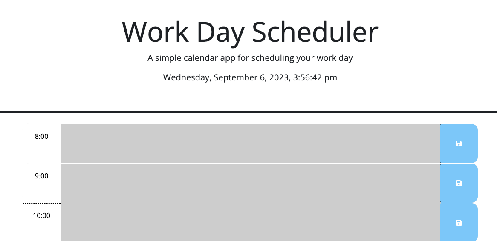
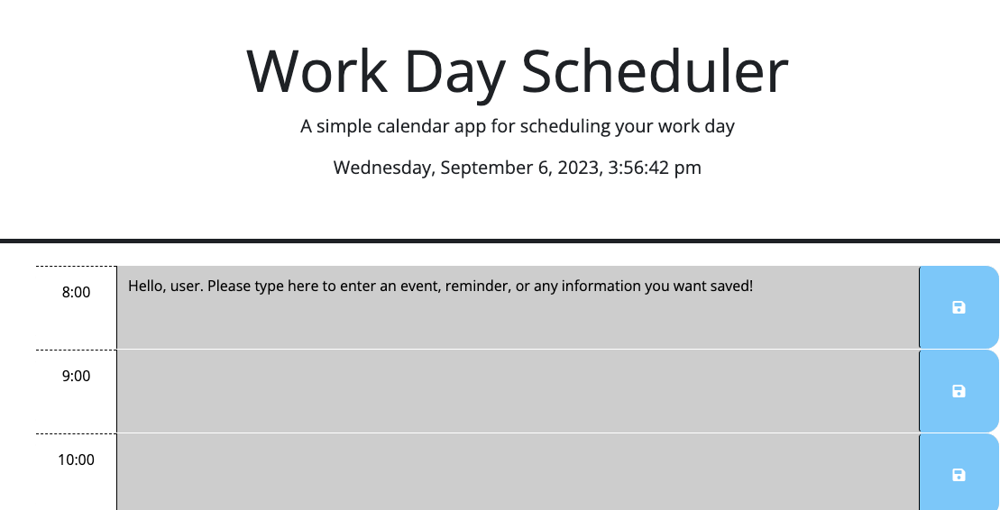

# When You Work: A daily scheduler

  Deployable Link - > https://digitallyintrinsic.github.io/whenyouwork/

## Table of Contents: 
  - [License:](#license)
  - [Description:](#description)
  - [Installation Instructions:](#installation-instructions)
  - [Github:](#github)
  - [My Email Address:](#my-email-address)
  - [Other Contributors:](#other-contributors)
  - [Images:](#images)

## License:

## Description:
This website is a basic daily scheduler that is built using HTML, CSS, and JavaScript, utilizing day.js. The objective of the scheduler is to indicate time present, past and future by color code. As well as allow users to store itinerary information and have it perist over refreshes. Please enjoy.

## Installation Instructions: 
You can use the link above to open in a default browser, or compile the code in your favorite code editor and push locally.

## Github: 
Check out more projects on my Github at https://github.com/DigitallyIntrinsic

## My Email Address:
If you have any questions, or see where this code can be made better, please feel free to email me at gitboot@1002.us

## Other Contributors:
None at this time.

## Images:

